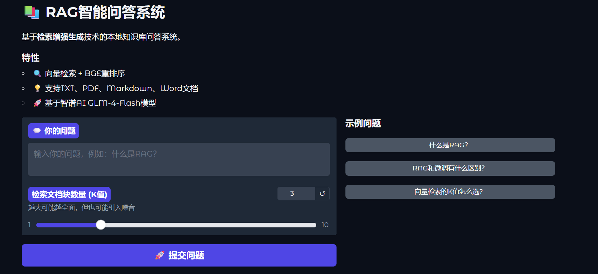

# RAG智能问答系统

基于检索增强生成（RAG）的本地知识库问答系统。

## 功能特性

- 支持多格式文档：TXT、PDF、Markdown、Word
- 向量检索 + BGE重排序（Cross-Encoder）
- 基于智谱AI GLM-4-Flash生成答案
- Gradio Web界面，支持实时问答

## 快速开始

### 1. 安装依赖

pip install -r requirements.txt

### 2. 配置API Key

创建 .env 文件：

ZHIPU_API_KEY=你的智谱API密钥

### 3. 准备知识库

将文档放入 data/ 目录（支持上述格式）

### 4. 构建向量库

python build_vectorstore.py

### 5. 启动应用

python app.py

访问 http://localhost:7860 即可使用

## 项目结构

- app.py              # Gradio Web界面
- src/
  - loader.py         # 文档加载
  - splitter.py       # 文档切分
  - vectorstore.py    # 向量库操作
  - retriever.py      # 检索+重排
  - chain.py          # LLM生成
- data/               # 知识库文档
- requirements.txt    # 依赖列表
- .env                # API配置（不提交）

## 技术栈

- LangChain / Chroma / Sentence-Transformers
- Gradio / ZhipuAI API
- BAAI/bge-reranker-v2-m3

## 演示截图
未上传api_key与本地模型
